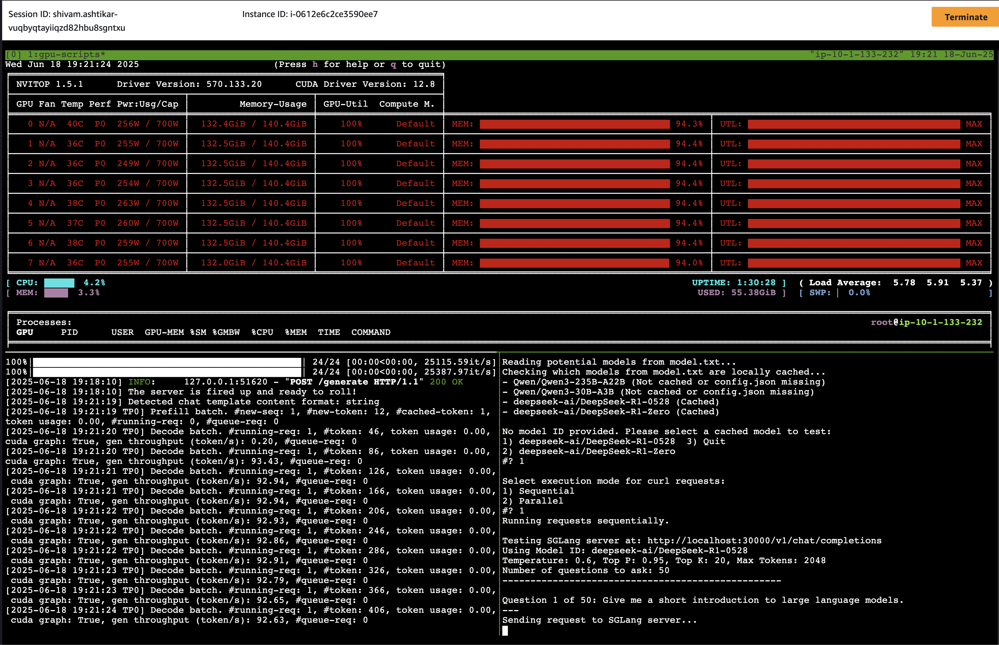

# SGLang Server Management and Testing Utilities

## Overview

This suite of scripts provides utilities for setting up an SGLang (Efficient Language Model Serving) environment, managing language models, launching an SGLang server, testing its functionality, and benchmarking its performance. These scripts are designed to streamline the process of working with various Hugging Face language models via SGLang, primarily on Linux-based systems with NVIDIA GPUs.

Key features include:
*   Automated environment setup including Python virtual environment, SGLang, CUDA checks, and other dependencies like `nvitop`.
*   Interactive model selection and download from Hugging Face.
*   Server launch with GPU auto-detection for tensor parallelism.
*   Interactive testing script with a large, customizable set of queries from `queries.txt`.
*   Parallel request batching for load testing.
*   Benchmark script for performance evaluation.

Below is an example of `nvitop` monitoring GPU usage while the `test_sglang_model.sh` script is sending requests to an SGLang server:



## Key Scripts & Files

*   **`setup-sglang.sh`**: Handles initial environment setup, dependency installation (SGLang, `nvitop`, etc.), CUDA checks, and model downloads.
*   **`start-sglang.sh`**: Launches the SGLang server with a selected cached model and auto-detected GPU configuration.
*   **`test_sglang_model.sh`**: Interactively tests a running SGLang server using questions from `queries.txt`, with options for sequential or batched parallel requests.
*   **`benchmark.sh`**: Benchmarks a selected model by managing its own SGLang server instance.
*   **`model.txt`**: Plain text file to list Hugging Face model identifiers for download and use.
*   **`queries.txt`**: Plain text file containing questions for `test_sglang_model.sh`.
*   **`scripts/`**: Directory containing utility Python scripts (`check_model_cached.py`, `detect_gpus.py`).
*   **`docs/`**: Directory containing detailed documentation.
*   **`LICENSE`**: Contains the Apache License 2.0 for the project.

## Quick Start / Basic Workflow

1.  **Populate `model.txt`**: Add Hugging Face model IDs you want to use.
2.  **Run Setup**: 
    ```bash
    chmod +x *.sh 
    ./setup-sglang.sh
    ```
    Follow prompts to download models and install dependencies.
3.  **Start Server**:
    ```bash
    ./start-sglang.sh
    ```
    Select a downloaded model to launch the server.
4.  **Test Server** (in a new terminal):
    ```bash
    ./test_sglang_model.sh
    ```
    Select a model and execution mode.
5.  **Benchmark Server** (optional, stops any running server started by `start-sglang.sh` if on the same port, as it manages its own):
    ```bash
    ./benchmark.sh
    ```

## Detailed Documentation

For more in-depth information, please refer to the following documents in the `docs/` directory:

*   **[Prerequisites](docs/PREREQUISITES.md)**: System and software requirements.
*   **[Detailed File Descriptions](docs/DETAILED_FILE_DESCRIPTIONS.md)**: In-depth explanation of each file.
*   **[Setup and Configuration Guide](docs/SETUP_AND_CONFIGURATION.md)**: Detailed setup steps.
*   **[Usage Instructions](docs/USAGE_INSTRUCTIONS.md)**: Comprehensive guide on using each script.
*   **[Customization Guide](docs/CUSTOMIZATION_GUIDE.md)**: How to tailor scripts and queries.
*   **[Troubleshooting Guide](docs/TROUBLESHOOTING_GUIDE.md)**: Solutions for common issues.

## License

This project is licensed under the Apache License 2.0. See the `LICENSE` file for full details.
